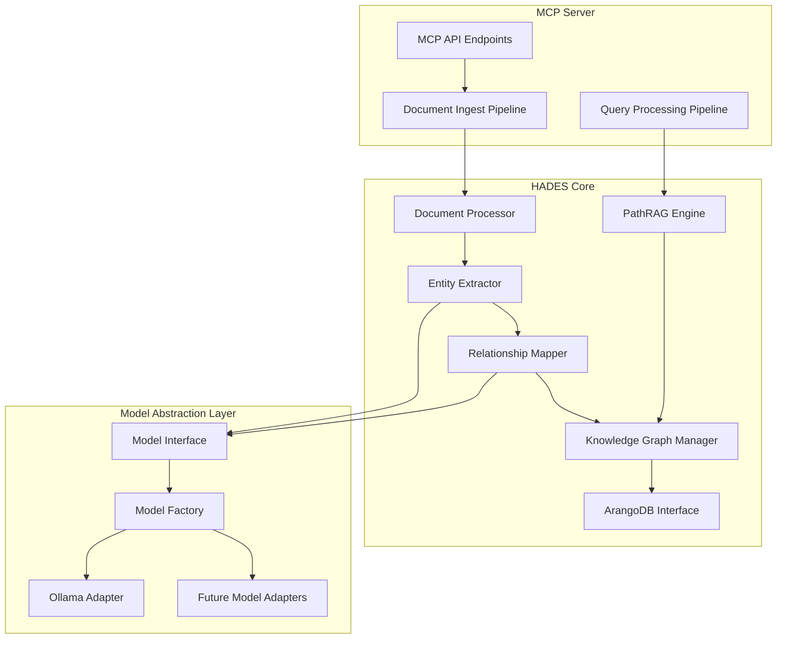

# HADES Embedded Model Implementation Plan

## 1. Project Overview

This implementation plan details the process of integrating an embedded LLM (initially using Ollama) into the HADES knowledge graph system while maintaining the flexibility to swap models as needed. The architecture follows the embedded model approach with a robust abstraction layer, serving as the intelligence core for extracting entities and relationships during knowledge graph construction.

**Cross-References:**
- See [HADES_Architecture_Overview.md](HADES_Architecture_Overview.md) for the overall system architecture
- See [HADES_Development_phases.md](HADES_Development_phases.md) Phase 3 for related timeline
- See [HADES_Implementation_Specification.md](HADES_Implementation_Specification.md) for the implementation order

## 2. System Architecture

### 2.1 High-Level Architecture



### 2.2 Component Descriptions

- **Document Processor**: Handles parsing and preprocessing of incoming documents
- **Entity Extractor**: Extracts entities from documents using the LLM
- **Relationship Mapper**: Identifies relationships between entities using the LLM
- **Knowledge Graph Manager**: Manages the graph structure and operations
- **Model Interface**: Abstract interface for interacting with LLMs
- **Model Factory**: Creates appropriate model implementation based on configuration
- **Ollama Adapter**: Adapter for interacting with Ollama-served models

## 3. Implementation Phases

### Phase 1: Foundation and Infrastructure (2-3 weeks)

#### 3.1 Model Abstraction Layer

1. **Create Model Interface (Week 1)**
   - Define abstract base class with key methods:
     - `extract_entities(document)`
     - `identify_relationships(entities, document)`
     - `classify_document_type(document)`
     - `generate_context(query, entities)`
   - Build common prompt templates and response parsers

2. **Implement Ollama Adapter (Week 1)**
   - Create adapter class implementing the model interface
   - Set up Ollama client for communicating with Ollama server
   - Implement model loading and configuration
   - Add retry and error handling logic

3. **Develop Model Factory (Week 1)**
   - Create factory class to instantiate appropriate model
   - Implement configuration loading from environment/config files
   - Add model caching mechanism for performance

**Deliverable:** Functioning model abstraction layer with Ollama integration

**Cross-References:**
- Aligns with [HADES_Development_phases.md](HADES_Development_phases.md) Phase 3 timeline
- Supports the MCP Server implementation described in [HADES_Implementation_Specification.md](HADES_Implementation_Specification.md)

#### 3.2 Core Processing Pipeline (Week 2)

1. **Document Processor**
   - Implement document type detection
   - Create parsers for different document formats (markdown, code, etc.)
   - Build chunking strategies based on document type

2. **Entity Extractor**
   - Implement entity extraction logic using LLM
   - Create entity validation and normalization
   - Add caching for improved performance

3. **Relationship Mapper**
   - Develop relationship identification logic using LLM
   - Implement relationship type categorization
   - Create confidence scoring for relationships

**Deliverable:** End-to-end document processing pipeline

### Phase 2: Knowledge Graph Integration (2 weeks)

#### 3.3 Knowledge Graph Manager (Week 3)

1. **Graph Schema Design**
   - Define entity and relationship schemas
   - Create graph structure for different document types
   - Design versioning approach for entities based on [README_VERSIONING.md](README_VERSIONING.md)

2. **Graph Operations Implementation**
   - Implement entity creation/update methods
   - Create relationship management functions
   - Add batch operations for efficiency

3. **ArangoDB Integration**
   - Enhance existing ArangoDB interface (Native for Ubuntu Noble 24.04 compatibility)
   - Implement graph traversal functions
   - Add query building helpers

**Deliverable:** Functioning knowledge graph manager integrated with processing pipeline

**Cross-References:**
- Works with native ArangoDB deployment described in [README.md](README.md)
- Interfaces with the PathRAG implementation outlined in [HADES_Implementation_Specification.md](HADES_Implementation_Specification.md)

#### 3.4 PathRAG Enhancement (Week 4)

1. **Update PathRAG Engine**
   - Enhance query processing with entity awareness
   - Implement relationship-based path finding
   - Add context injection from LLM

2. **Query Processing Pipeline**
   - Create query understanding component using LLM
   - Implement query decomposition for complex queries
   - Build result composition logic

**Deliverable:** Enhanced PathRAG with entity/relationship awareness

### Phase 3: MCP Server Integration (1-2 weeks)

#### 3.5 API Extensions (Week 5)

1. **Enhance Ingest Endpoint**
   - Update `ingest_data` to use new processing pipeline
   - Add progress tracking and batch processing support
   - Implement error handling and reporting

2. **Enhance Retrieval Endpoint**
   - Update `pathrag_retrieve` to use enhanced PathRAG
   - Add relationship query capabilities
   - Implement explanations for retrieval results

3. **Add New Endpoints**
   - `get_entity_details`: Retrieve details about specific entities
   - `find_relationships`: Find relationships between entities
   - `get_graph_visualization`: Generate graph visualization data

**Deliverable:** Enhanced MCP server with new capabilities

**Cross-References:**
- Extends the MCP server described in [docs/windsurf_integration.md](docs/windsurf_integration.md)
- Configured for stdio transport as described in existing implementation

#### 3.6 Testing and Documentation (Week 6)

1. **Comprehensive Testing**
   - Unit tests for all components
   - Integration tests for the full pipeline using real PostgreSQL connections
   - Performance benchmarking

2. **Documentation**
   - API documentation for all endpoints
   - Component interaction documentation
   - Model configuration guide

**Deliverable:** Fully tested and documented system

## 4. Technical Implementation Details

### 4.1 Model Interface

```python
from abc import ABC, abstractmethod
from typing import Dict, List, Any, Optional

class LLMProcessor(ABC):
    """Abstract interface for LLM processing capabilities."""
    
    @abstractmethod
    def extract_entities(self, document: Dict[str, Any]) -> List[Dict[str, Any]]:
        """
        Extract entities from a document with clear typing and atomic observations.
        
        Returns a list of entity dictionaries with the following structure:
        {
            'name': 'entity_name',           # Unique identifier for the entity
            'entity_type': 'concept',        # Type classification (person, concept, organization, etc.)
            'observations': [                # List of atomic, discrete facts about the entity
                'Fact 1',
                'Fact 2'
            ]
        }
        """
        pass
    
    @abstractmethod
    def identify_relationships(self, entities: List[Dict[str, Any]], 
                              document: Dict[str, Any]) -> List[Dict[str, Any]]:
        """
        Identify relationships between entities with clear directionality.
        
        Returns a list of relationship dictionaries with the following structure:
        {
            'from': 'entity1_name',          # Source entity name
            'to': 'entity2_name',            # Target entity name
            'relation_type': 'depends_on'    # Relationship type in active voice
        }
        """
        pass
    
    @abstractmethod
    def classify_document_type(self, document: Dict[str, Any]) -> str:
        """Determine the document type for specialized processing."""
        pass
    
    @abstractmethod
    def generate_context(self, query: str, 
                        relevant_entities: List[Dict[str, Any]]) -> str:
        """Generate additional context for a query based on entities."""
        pass
```

### 4.2 Ollama Adapter

```python
import json
import requests
from typing import Dict, List, Any, Optional

from .llm_processor import LLMProcessor
from .prompt_templates import (
    ENTITY_EXTRACTION_PROMPT,
    RELATIONSHIP_EXTRACTION_PROMPT,
    DOCUMENT_CLASSIFICATION_PROMPT,
    CONTEXT_GENERATION_PROMPT
)

class OllamaProcessor(LLMProcessor):
    """Adapter for using Ollama-served models."""
    
    def __init__(self, model_name: str, 
                base_url: str = "http://localhost:11434", 
                temperature: float = 0.1,
                max_retries: int = 3):
        self.model_name = model_name
        self.base_url = base_url
        self.temperature = temperature
        self.max_retries = max_retries
        
    def _call_ollama(self, prompt: str, system_prompt: str = None) -> str:
        """Make a call to the Ollama API."""
        url = f"{self.base_url}/api/generate"
        
        payload = {
            "model": self.model_name,
            "prompt": prompt,
            "temperature": self.temperature,
            "stream": False
        }
        
        if system_prompt:
            payload["system"] = system_prompt
            
        for attempt in range(self.max_retries):
            try:
                response = requests.post(url, json=payload)
                response.raise_for_status()
                return response.json()["response"]
            except Exception as e:
                if attempt == self.max_retries - 1:
                    raise Exception(f"Failed to call Ollama after {self.max_retries} attempts: {str(e)}")
                continue
    
    def extract_entities(self, document: Dict[str, Any]) -> List[Dict[str, Any]]:
        """Extract entities from a document using Ollama."""
        prompt = ENTITY_EXTRACTION_PROMPT.format(
            title=document.get("title", "Untitled"),
            content=document.get("content", ""),
            metadata=json.dumps(document.get("metadata", {}))
        )
        
        system_prompt = (
            "You are an expert at identifying entities in text. Extract all named entities, concepts, and technical terms. "
            "For each entity, provide a unique name, entity type, and a list of atomic observations (discrete facts) about the entity. "
            "Return the results as a properly formatted JSON array."
        )
        
        response = self._call_ollama(prompt, system_prompt)
        
        # Parse the response to extract structured entity data
        try:
            # The response should be a JSON string containing entities
            entities = json.loads(response)
            
            # Ensure each entity has the required structure
            normalized_entities = []
            for entity in entities:
                # Make sure entity has all required fields
                if 'name' not in entity or 'entity_type' not in entity:
                    continue
                    
                # Ensure observations is a list of strings
                observations = entity.get('observations', [])
                if not isinstance(observations, list):
                    observations = [str(observations)]
                    
                normalized_entities.append({
                    'name': entity['name'],
                    'entity_type': entity['entity_type'],
                    'observations': observations
                })
                
            return normalized_entities
        except json.JSONDecodeError:
            # Fallback parsing if the model doesn't return proper JSON
            # Implement custom parsing logic here
            return []
    
    def identify_relationships(self, entities: List[Dict[str, Any]], document: Dict[str, Any]) -> List[Dict[str, Any]]:
        """Identify relationships between entities using Ollama."""
        # Skip relationship identification if there are too few entities
        if len(entities) < 2:
            return []
            
        # Create a context with entity information for the prompt
        entity_context = "\n".join([f"Entity: {e['name']} (Type: {e['entity_type']})" for e in entities])
        
        prompt = RELATIONSHIP_EXTRACTION_PROMPT.format(
            title=document.get("title", "Untitled"),
            content=document.get("content", ""),
            entity_context=entity_context
        )
        
        system_prompt = (
            "You are an expert at identifying relationships between entities. "
            "Identify directed relationships between the provided entities using the document context. "
            "Each relationship should have a source entity (from), target entity (to), and relationship type in active voice. "
            "Return the results as a properly formatted JSON array."
        )
        
        response = self._call_ollama(prompt, system_prompt)
        
        # Parse the response to extract structured relationship data
        try:
            # The response should be a JSON string containing relationships
            relationships = json.loads(response)
            
            # Ensure each relationship has the required structure
            normalized_relationships = []
            entity_names = {entity['name'] for entity in entities}
            
            for relation in relationships:
                # Make sure relation has all required fields
                if 'from' not in relation or 'to' not in relation or 'relation_type' not in relation:
                    continue
                    
                # Make sure both entities exist in our entity list
                if relation['from'] not in entity_names or relation['to'] not in entity_names:
                    continue
                    
                normalized_relationships.append({
                    'from': relation['from'],
                    'to': relation['to'],
                    'relation_type': relation['relation_type']
                })
                
            return normalized_relationships
        except json.JSONDecodeError:
            # Fallback parsing if the model doesn't return proper JSON
            return []
    
    # Implement other abstract methods similarly
    # ...
```

### 4.3 Model Factory

```python
import os
from typing import Dict, Any

from .llm_processor import LLMProcessor
from .ollama_processor import OllamaProcessor

class ModelFactory:
    """Factory for creating LLM processor instances."""
    
    _instances = {}  # Cache of model instances
    
    @classmethod
    def get_processor(cls, model_type: str = None, **kwargs) -> LLMProcessor:
        """
        Get an appropriate LLM processor instance.
        
        Args:
            model_type: Type of model to use (ollama, vllm, etc.)
            **kwargs: Additional configuration parameters
            
        Returns:
            An instance of LLMProcessor
        """
        # Use environment variable if model_type not specified
        if model_type is None:
            model_type = os.environ.get("HADES_MODEL_TYPE", "ollama")
            
        # Create cache key from model_type and relevant kwargs
        cache_key = f"{model_type}:{kwargs.get('model_name', 'default')}"
        
        # Return cached instance if available
        if cache_key in cls._instances:
            return cls._instances[cache_key]
            
        # Create new instance based on model_type
        if model_type.lower() == "ollama":
            model_name = kwargs.get("model_name", os.environ.get("HADES_OLLAMA_MODEL", "qwen2:32b-coder"))
            base_url = kwargs.get("base_url", os.environ.get("HADES_OLLAMA_URL", "http://localhost:11434"))
            temperature = float(kwargs.get("temperature", os.environ.get("HADES_MODEL_TEMPERATURE", "0.1")))
            
            processor = OllamaProcessor(
                model_name=model_name,
                base_url=base_url,
                temperature=temperature
            )
        else:
            raise ValueError(f"Unsupported model type: {model_type}")
            
        # Cache the instance
        cls._instances[cache_key] = processor
        return processor
```

### 4.4 Document Processing Pipeline

```python
from typing import Dict, List, Any

from .model_factory import ModelFactory

class DocumentProcessor:
    """Processes documents for knowledge graph ingestion."""
    
    def __init__(self, model_config: Dict[str, Any] = None):
        """
        Initialize the document processor.
        
        Args:
            model_config: Configuration for the LLM processor
        """
        self.model_config = model_config or {}
        self.llm = ModelFactory.get_processor(**self.model_config)
        
    def process_document(self, document: Dict[str, Any]) -> Dict[str, Any]:
        """
        Process a document to extract entities and relationships.
        
        Args:
            document: The document to process
            
        Returns:
            Dict containing extracted entities and relationships
        """
        # Classify document type
        doc_type = self.llm.classify_document_type(document)
        
        # Extract entities
        entities = self.llm.extract_entities(document)
        
        # Identify relationships
        relationships = self.llm.identify_relationships(entities, document)
        
        return {
            "document_id": document.get("id"),
            "document_type": doc_type,
            "entities": entities,
            "relationships": relationships
        }
```

### 4.5 MCP Server Integration

```python
from typing import Dict, List, Any
from datetime import datetime

from src.core.document_processor import DocumentProcessor
from src.core.knowledge_graph import KnowledgeGraphManager

class MCPProcessor:
    """Processes MCP requests for HADES."""
    
    def __init__(self):
        """Initialize the MCP processor."""
        self.document_processor = DocumentProcessor()
        self.graph_manager = KnowledgeGraphManager()
        
    async def ingest_data(self, params: Dict[str, Any], session_data: Dict[str, Any]) -> Dict[str, Any]:
        """
        Process data ingestion requests.
        
        Args:
            params: Parameters for the request
            session_data: Session data including authentication info
            
        Returns:
            Dict containing ingestion results
        """
        if not session_data.get("authenticated", False):
            return {"success": False, "error": "Not authenticated"}
            
        data = params.get("data", [])
        domain = params.get("domain", "general")
        as_of_version = params.get("as_of_version")
        
        entities_created = 0
        relationships_created = 0
        
        # Process each document
        for document in data:
            # Process the document
            processed = self.document_processor.process_document(document)
            
            # Add to knowledge graph
            result = self.graph_manager.add_processed_document(
                processed, 
                domain=domain,
                version=as_of_version
            )
            
            entities_created += result.get("entities_created", 0)
            relationships_created += result.get("relationships_created", 0)
            
        return {
            "success": True,
            "ingested_count": {
                "entities": entities_created,
                "relationships": relationships_created
            },
            "domain": domain,
            "version": as_of_version or "v0.0.0",
            "timestamp": datetime.now().isoformat()
        }
```

## 5. Configuration and Deployment

### 5.1 Environment Variables

```
# Model Configuration
HADES_MODEL_TYPE=ollama
HADES_OLLAMA_MODEL=qwen2:32b-coder
HADES_OLLAMA_URL=http://localhost:11434
HADES_MODEL_TEMPERATURE=0.1

# Database Configuration
HADES_ARANGO_URL=http://localhost:8529
HADES_ARANGO_USER=hades
HADES_ARANGO_PASSWORD=o$n^3W%QD0HGWxH!
HADES_ARANGO_DATABASE=hades_test

# Processing Configuration
HADES_BATCH_SIZE=10
HADES_MAX_DOCUMENT_SIZE=1000000
```

### 5.2 Deployment Steps

1. **Install Dependencies**
   ```bash
   pip install -r requirements.txt
   ```

2. **Set Up Ollama**
   ```bash
   # Install Ollama
   curl -fsSL https://ollama.com/install.sh | sh
   
   # Pull the desired model
   ollama pull qwen2:32b-coder
   ```

3. **Configure Environment**
   ```bash
   cp .env.example .env
   # Edit .env with appropriate settings
   ```

4. **Initialize Database**
   ```bash
   python src/db/init_db.py
   ```

5. **Start MCP Server**
   ```bash
   python -m src.mcp.server --stdio
   ```

**Cross-References:**
- Uses stdio transport configuration described in [docs/windsurf_integration.md](docs/windsurf_integration.md)
- Accesses ArangoDB via native deployment for Ubuntu Noble (24.04) compatibility

## 6. Testing Strategy

### 6.1 Unit Tests

- Test each component in isolation with mock dependencies
- Focus on model abstraction layer, entity extraction, and relationship mapping
- Use parametrized tests to verify behavior with different inputs

### 6.2 Integration Tests

- Test end-to-end document processing
- Verify correct graph construction
- Test retrieval capabilities using real PostgreSQL connections

### 6.3 Model Swapping Tests

- Verify the ability to switch between different models
- Test with mock model implementations

## 7. Extensibility for Future Models

### 7.1 Adding a New Model Type

To add support for a new model type (e.g., vLLM), you will need to:

1. Create a new adapter class implementing the `LLMProcessor` interface
2. Add the new model type to the `ModelFactory`
3. Update configuration documentation

### 7.2 Model Versioning

The system is designed to support model versioning:

- Store model metadata with each extraction
- Allow retrieval with specific model versions
- Support model comparison and evaluation

## 8. Resource Requirements

- **Hardware**: 16GB+ RAM, 8+ CPU cores for development, GPU recommended for production
- **Storage**: 20GB+ for code, models, and database
- **Network**: Localhost deployment initially, consider secure remote access for production

## 9. Risk Mitigation

### 9.1 Technical Risks

- **Model Performance**: Run benchmarks early to ensure acceptable performance
- **Integration Complexity**: Use phased approach with clear milestones
- **ArangoDB Scalability**: Plan for data growth and implement efficient queries

### 9.2 Fallback Strategies

- **Model Failure**: Implement retry logic and simpler fallback extraction methods
- **Performance Issues**: Add caching layers and consider asynchronous processing
- **Integration Problems**: Maintain ability to revert to simpler document ingestion

### 4.5 Prompt Templates

```python
# prompt_templates.py

# Entity extraction prompt template
ENTITY_EXTRACTION_PROMPT = """
Title: {title}

Content: {content}

Metadata: {metadata}

Extract all named entities, concepts, and technical terms from the above document.
For each entity, include a unique name, entity type (person, organization, concept, etc.), and a list of discrete observations (facts).
Return the results as a valid JSON array of entity objects with the following structure:
{{
  "name": "entity_name",
  "entity_type": "type_classification", 
  "observations": ["Fact 1", "Fact 2", ...]
}}
"""

# Relationship extraction prompt template
RELATIONSHIP_EXTRACTION_PROMPT = """
Title: {title}

Content: {content}

Entity Context: 
{entity_context}

Identify the directed relationships between the entities listed above based on the document content.
Return the results as a valid JSON array of relationship objects with the following structure:
{{
  "from": "source_entity_name",
  "to": "target_entity_name",
  "relation_type": "relationship_type" 
}}

Ensure each relationship type is in active voice (e.g., "depends_on", "created_by", "contains", etc.).
Only include relationships that are explicitly or implicitly supported by the document content.
"""

# Document classification prompt template
DOCUMENT_CLASSIFICATION_PROMPT = """
Title: {title}

Content: {content}

Metadata: {metadata}

Determine the most appropriate document type classification for the above content.
Choose from the following types: technical, academic, business, news, or personal.
Provide your answer as a single word.
"""

# Context generation prompt template
CONTEXT_GENERATION_PROMPT = """
Query: {query}

Relevant Entity Information:
{entity_info}

Based on the query and the relevant entity information provided, generate additional context
that would be helpful for answering the query. Focus on synthesizing the entity information
into a coherent narrative that addresses the query's intent.

Limit your response to 2-3 paragraphs maximum.
"""
```

## 10. Timeline and Milestones

- **Week 1-2**: Model abstraction layer and basic document processing
- **Week 3-4**: Knowledge graph integration and PathRAG enhancement
- **Week 5-6**: MCP server integration, testing, and documentation
- **Week 7-8**: Performance optimization and deployment

## 11. Future Enhancements

- **GNN Integration**: Add graph neural networks for relationship inference
- **Multi-model Ensemble**: Use multiple models for different aspects of processing
- **Active Learning**: Implement feedback loop for improving entity/relationship extraction
- **Cross-domain Connections**: Identify relationships across different domains

This implementation plan provides a comprehensive roadmap for integrating an embedded LLM into HADES while maintaining model flexibility through a robust abstraction layer. It aligns with the overall architecture and development phases while addressing the specific requirements for knowledge graph construction with intelligent entity and relationship extraction.